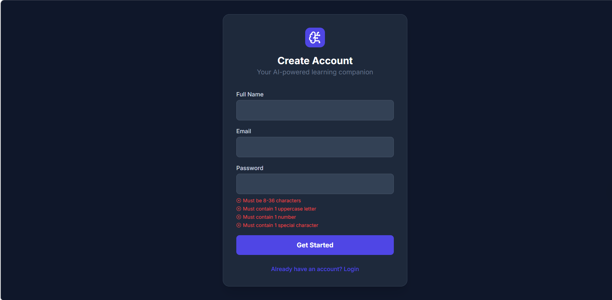
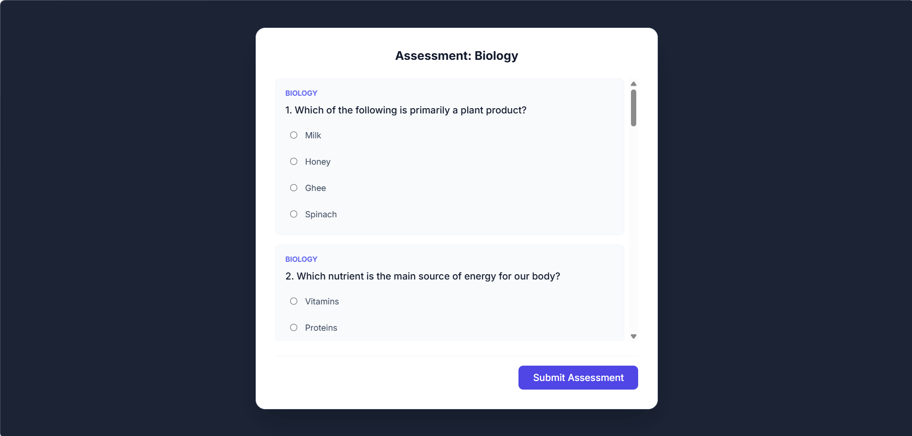

# 🧠 NeuroTutor AI

<p align="center">


</p>

<p align="center">
An AI-powered personalized learning platform that generates customized learning paths, conducts diagnostic assessments, tracks progress, and provides intelligent tutoring using Google Gemini AI.
</p>

---

# 📖 Overview

NeuroTutor AI is a smart learning platform designed to personalize education for every student.

Students can:

- 📚 Select their class
- 📝 Take a diagnostic assessment
- 🤖 Receive an AI-generated personalized learning path
- 📈 Track learning progress
- 💬 Learn with an AI Tutor
- 📂 Upload syllabus for AI-based topic generation
- 👤 Manage profile and subjects

---

# ✨ Features

- 🤖 Google Gemini AI Integration
- 📊 Personalized Learning Paths
- 📝 Diagnostic Quiz
- 📈 Student Progress Dashboard
- 📚 Subject Management
- 📂 Upload Syllabus
- 👤 Profile Management
- 🌙 Modern Responsive UI
- ⚡ Fast React + Vite Application

---

# 🛠 Tech Stack

## Frontend

- React 19
- TypeScript
- Vite

## AI

- Google Gemini AI

## Libraries

- Recharts
- Lucide React

---

# 📂 Project Structure

```text
NeuroTutor-AI
│
├── public/
├── src/
│   ├── components/
│   ├── pages/
│   ├── services/
│   ├── hooks/
│   └── assets/
│
├── Screenshots/
│   ├── Signup-page.png
│   ├── Select the Class page.png
│   ├── Subject Selection page.png
│   ├── Assessmentpage.png
│   ├── AI recommended Learningpath.png
│   ├── Add a new subject-page.png
│   ├── Upload Syallabus page.png
│   └── EditProfile page.png
│
├── package.json
└── README.md
```

---

# 📸 Application Screenshots

## 🔐 Signup Page

<p align="center">

</p>

---

## 🎓 Class Selection

<p align="center">

</p>

---

## 📚 Subject Selection

<p align="center">

</p>

---

## 📝 Diagnostic Assessment

<p align="center">

</p>

---

## 🤖 AI Recommended Learning Path

<p align="center">

</p>

---

## ➕ Add New Subject

<p align="center">

</p>

---

## 📂 Upload Syllabus

<p align="center">

</p>

---

## 👤 Edit Profile

<p align="center">

</p>

---

# 🚀 Run Locally

## Clone Repository

```bash
git clone https://github.com/bhargavi4470/neurotutor-ai.git

cd neurotutor-ai
```

---

## Install Dependencies

```bash
npm install
```

---

## Configure Environment Variables

Create a file named:

```text
.env.local
```

Add your Gemini API key:

```env
GEMINI_API_KEY=YOUR_API_KEY
```

---

## Start Development Server

```bash
npm run dev
```

Runs on

```
http://localhost:5173
```

---

# 💡 Future Enhancements

- 🎤 Voice-based AI Tutor
- 📱 Mobile Application
- 🏆 Achievement Badges
- 👨‍🏫 Teacher Dashboard
- 📊 Advanced Analytics
- 🌐 Multi-language Support
- 📹 AI Video Explanations

---

# 👩‍💻 Developed By

**Bhargavi**

GitHub: https://github.com/bhargavi4470

---

# ⭐ Show Your Support

If you like this project, consider giving it a ⭐ on GitHub.
